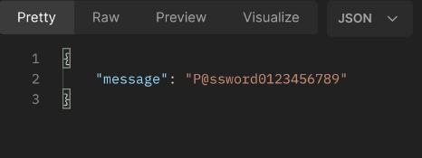

# Managed Identities - under the hood
### A basic Flask API for an Azure Managed Identity talk

This repo, together with the Terraform AWS EC2 deployment here - https://github.com/al-wilkinson/flask-talk-vm - contain all the code for the demo part of a talk I am presenting a deeper dive into Azure Managed Identies.

### Prerequesites
* An Azure subscription
* The Azure CLI installed and authenticated with an account with at least Contributor privileges to the above subscription.
* I have pre-configured an Azure Key Vault storing a secret.  For the demo, the key vault and secret name are hardcoded in the kvt.py module.
* Though not required to deploy the Azure Web App, Python 3 and Pip are required to run the flask app locally.
* Again though not strictly required, access to a Postman instance makes things easier.  We're only using GET requests to demo what is going on with the managed identity, curl or a browser will work fine.

The code will deploy a basic API written using the Python Flask framework to an Azure Web App.  The web app will interact with an Azure Key Vault to retrieve a secret, using a Managed Identity for authentication.  The fake_data.py module creates some fake test data so that our API endpoints return something.

### Walkthrough
Clone the repo locally:<br>
```git clone https://github.com/al-wilkinson/flask-talk.git```

Authenticate an Azure CLI session with ```az login```.  If you have more than one Azure subscription check you have selected the one you wish to deploy into as default with ```az account list --output table```.  Use ```az account set --name "your subscription name"``` if needed.

Make sure that ```flask-talk``` is your current directory, cd into it if not and deploy the Azure Web App with:<br>```az webapp up --runtime PYTHON:3.12 --sku B1 --logs --resource-group rg-webapp-demo --name webapp-demo-e4f51d47f18a4aae8366b7cd56e6756a```<br>
The Web App name must be globally unique.  Note that we have not assigned either a system or user Managed Identity at this point.

When the web app has deployed test a couple of API endpoints.  There are some "dev" ones in the code.

https://webapp-demo-e4f51d47f18a4aae8366b7cd56e6756a.azurewebsites.net/get-all
<pre>
</br>
</pre>

**As I mentioned above, _all_ of the data is created using the Python Faker package.  There is no underlying database connected to the web app.  A new set of fake personal data is generated each time the web app is run.  Faker is interesting. It will generate common names and I have seen the names of real people during testing.  To emphasise again, this _is not real_ personal data.**

https://webapp-demo-e4f51d47f18a4aae8366b7cd56e6756a.azurewebsites.net/get-person/x2949994
<pre>
</br>
</pre>


There are also endpoints that will retrieve the secret from the key vault (a pattern common to a production API, though presenting the secret to a GET request would not really be optimal).

Also try these now, _before_ we have assigned a managed identity to the web app.

(Change from 404 not found to 403 Forbidden?)

https://webapp-demo-e4f51d47f18a4aae8366b7cd56e6756a.azurewebsites.net/get-secret

https://webapp-demo-e4f51d47f18a4aae8366b7cd56e6756a.azurewebsites.net/get-mi-token
<pre>
</br>
</pre>

Let's configure a managed identity for our web app and see what happens.  Again, we'd normally do this as part of a CI/CD deployment, probably with a user assigned managed identity (to allow for separation of duties between identity provision and development).  We'll do some portal click-ops to show what's going on.

Authenticate to https://portal.azure.com and navigate to our web app. Go to the Identity blade and turn on the system assigned managed identity.  Click Save.
<pre>
</br>
</pre>

Next, we should give this identity some RBAC permissions to access the secret in our predefined key vault.  But, we're going to pause and query the get-mi-token API endpoint again.
<pre>
</br>
</pre>
This time we are issued with a token. We'll save this for later.

We've created an identity.  Where is this and can we take a look at its properties?

We'll use PowerShell Graph to take a look at Entra.  In my case, I have PowerShell 7 and the Microsoft.Graph modules installed, as well as the required Graph API scopes configured in Entra. So starting PowerShell with ```pwsh``` and then authenticating using:
```
Connect-MgGraph -Scopes Application.Read.All
```
Then we can add:
```
$managedIdentity = Get-MgServicePrincipal -All | Where-Object { $_.DisplayName -like 'webapp*' }
$managedIdentity
$managedIdentity.ServicePrincipalType
```


Now we will grant our Web App access to the key vault via the Web App's managed identity.  Go to the IAM page for the secret, because we are using RBAC IAM, rather than the older Access Policies, we can assign access to the individual secret, rather than the entire key vault.  Add the ```Key Vault Secrets User``` role for the managed identity to the secret.

<pre>
</br>
</pre>

Head back to Postman and check the 
```
https://webapp-demo-e4f51d47f18a4aae8366b7cd56e6756a.azurewebsites.net/get-secret
```
endpoint again.

This time we get our secret returned from the key vault:
<pre>
</br>
</pre>

So far what we are seeing is exactly what we expect.  We have assigned an identity to the web app and granted access to the secret in our key vault.  But, what about the token we grabbed in Postman before we had assigned any permissions to our identity?

Let's try something.  Get the HEADER values.

Delete the web app.  Show the identity has gone.

Deploy an AWS VM - ie nothing connected with Azure.

Show using the token.